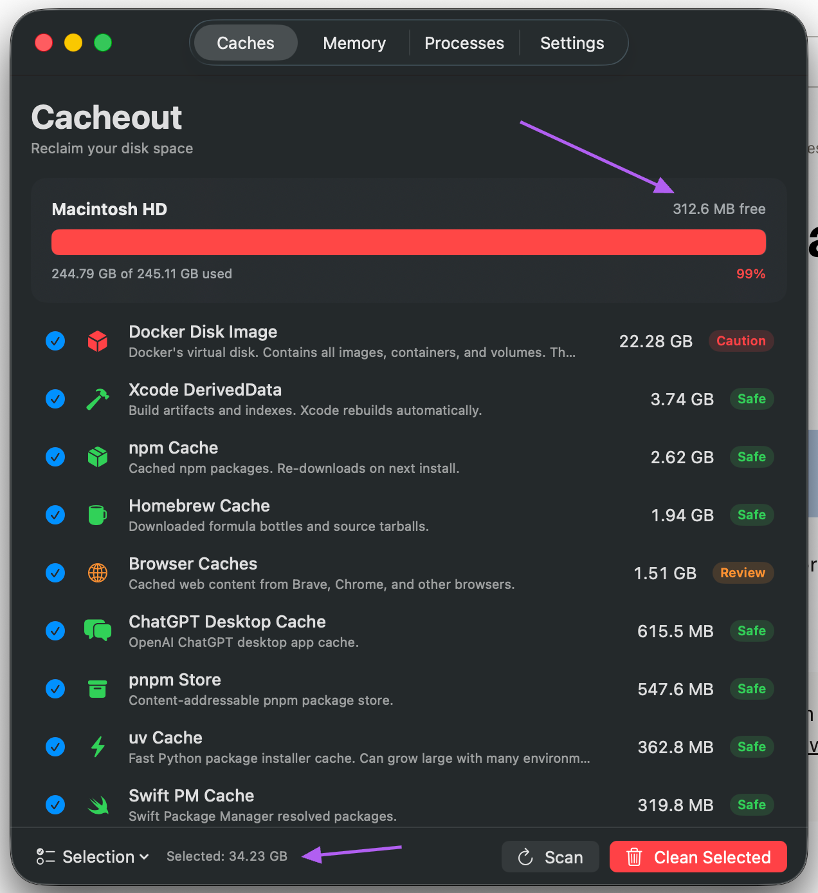
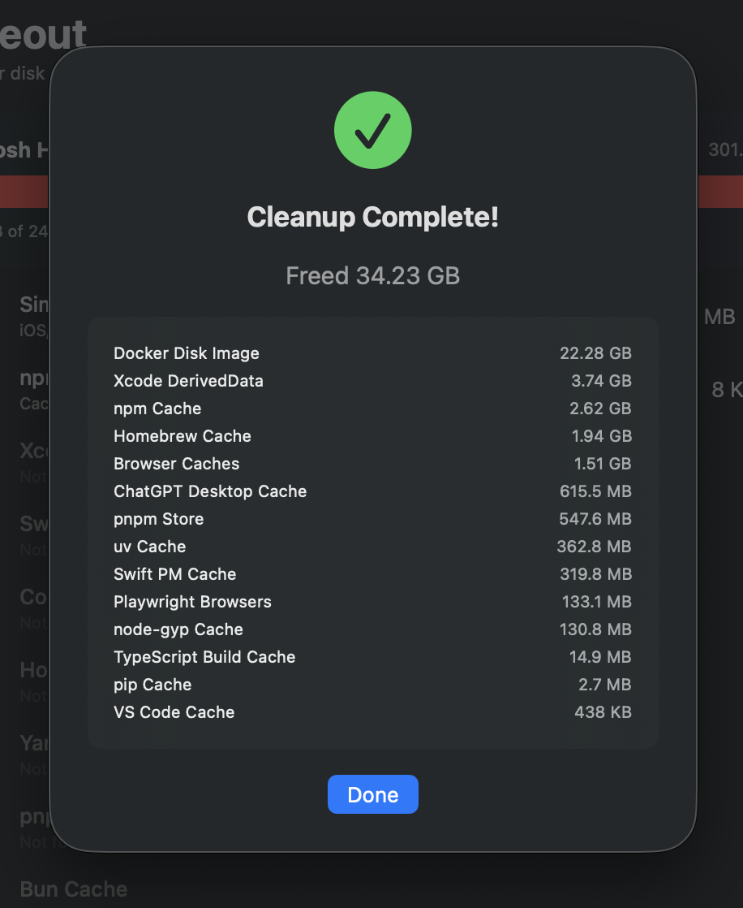
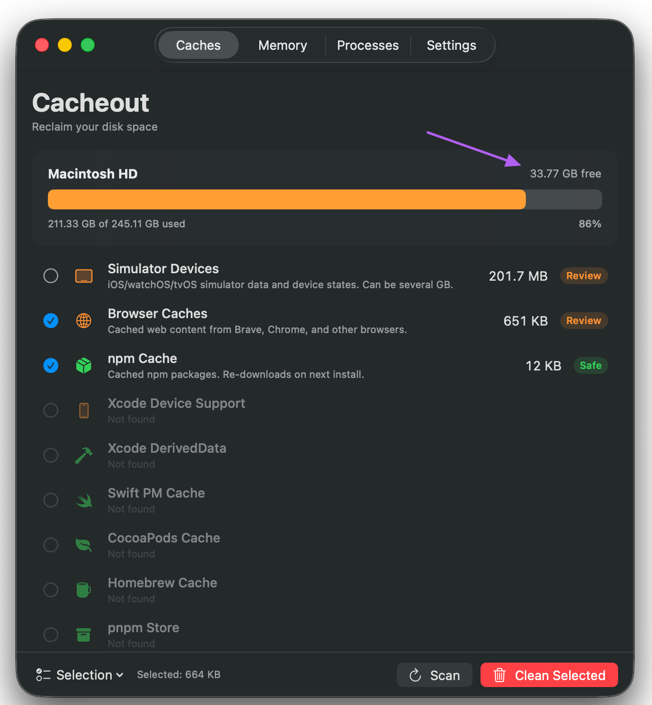

# Cacheout

A free, open-source macOS utility that helps developers reclaim disk space by scanning and cleaning common cache directories.

Built for developers on space-constrained Macs (especially the 256GB M4 Mac Mini), Cacheout finds and removes caches from Xcode, Docker, npm, Yarn, Homebrew, browsers, and more — typically recovering 20-60GB.

<p align="center">
  
  
  
</p>

## Features

- **15 built-in cache categories** — Xcode, Docker, npm, Yarn, pnpm, Homebrew, Playwright, CocoaPods, Swift PM, Gradle, browser caches, VS Code, Electron, pip
- **node_modules finder** — Recursively scans your project directories to find every `node_modules` folder, shows project name, size, and staleness (30d+), with per-project selection
- **Risk-level indicators** — Each category rated Safe / Review / Caution so you know what's risk-free
- **Async parallel scanning** — Scans all categories concurrently for fast results
- **Sparse file awareness** — Reports actual disk usage for Docker images (not inflated file sizes)
- **Move to Trash option** — Recoverable deletion instead of permanent removal
- **Cleanup logging** — All actions logged to `~/.cacheout/cleanup.log`
- **No admin privileges** — Only touches user-space caches (`~/Library/`, `~/.`)
- **No network access** — No analytics, no telemetry, no update checks
- **Native SwiftUI** — Lightweight, fast, feels like a first-party macOS app

## Requirements

- macOS 14 (Sonoma) or later
- Xcode 15+ or Swift 5.9+ toolchain (for building from source)

## Install

### Build & Run (recommended)

```bash
git clone https://github.com/yourusername/cacheout.git
cd cacheout
bash scripts/bundle.sh
open Cacheout.app
```

This builds the project and creates a proper `Cacheout.app` bundle you can drag to `/Applications`.

### Build from source (CLI)

```bash
swift build -c release
.build/release/Cacheout
```

### Open in Xcode

```bash
open Package.swift
# Build and run from Xcode (⌘R)
```

## Cache Categories

| Category | Risk | What happens after cleaning |
|----------|------|-----------------------------|
| Xcode DerivedData | ✅ Safe | Xcode rebuilds on next build |
| Xcode Device Support | 🟡 Review | Re-downloads when you connect a device |
| Homebrew Cache | ✅ Safe | Equivalent to `brew cleanup` |
| npm Cache | ✅ Safe | npm re-downloads on install |
| Yarn Cache | ✅ Safe | Yarn re-downloads on install |
| pnpm Store | ✅ Safe | pnpm re-downloads on install |
| Playwright Browsers | ✅ Safe | `npx playwright install` to restore |
| CocoaPods Cache | ✅ Safe | `pod install` re-downloads |
| Swift PM Cache | ✅ Safe | SPM re-resolves on next build |
| Gradle Cache | ✅ Safe | Gradle re-downloads on build |
| Docker Disk Image | 🔴 Caution | Removes all Docker data — run `docker system prune -a` first |
| Browser Caches | 🟡 Review | Browsers rebuild as you browse |
| VS Code Cache | ✅ Safe | VS Code re-downloads as needed |
| Electron Cache | ✅ Safe | Re-downloads when Electron apps need it |
| pip Cache | ✅ Safe | pip re-downloads on install |

## node_modules Finder

Cacheout includes a dedicated project scanner that recursively searches common developer directories (`~/Documents`, `~/Developer`, `~/Projects`, `~/Code`, `~/Desktop`, `~/Dropbox`, etc.) for `node_modules` folders.

Each discovered `node_modules` shows the project name, full path, size, and how old it is. Projects with stale node_modules (30+ days untouched) are flagged with an age badge. You can quickly select all stale projects, or pick individually.

This is especially impactful on space-constrained Macs — a single project's `node_modules` can be 500MB-1GB, and most developers have 5-20 projects sitting around.

## How it works

Cacheout scans known cache directories in your home folder (`~/Library/Caches`, `~/Library/Developer`, `~/.npm`, etc.) and calculates actual disk usage using `totalFileAllocatedSize` (which correctly handles sparse files like Docker's disk image).

You select which caches to clean, confirm the action, and Cacheout either moves them to Trash or permanently deletes them. All cleanup actions are logged.

## Contributing

PRs welcome! To add a new cache category, edit `Sources/Cacheout/Scanner/Categories.swift` and add a new `CacheCategory` entry.

## License

MIT — See [LICENSE](LICENSE)
