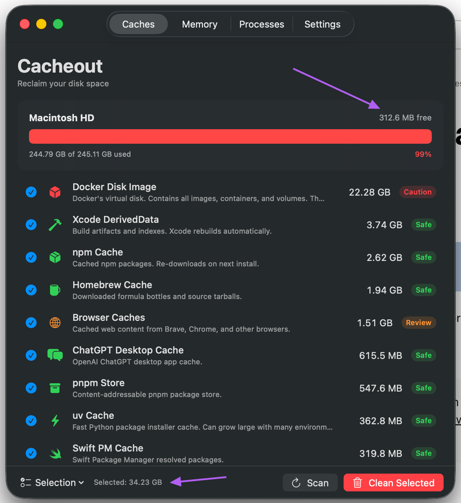
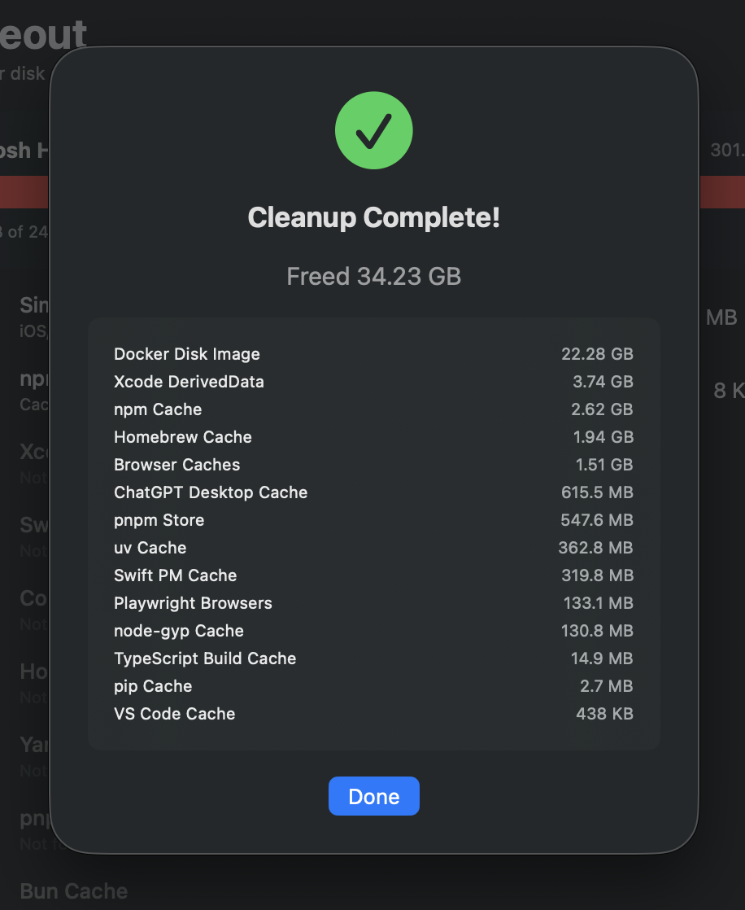
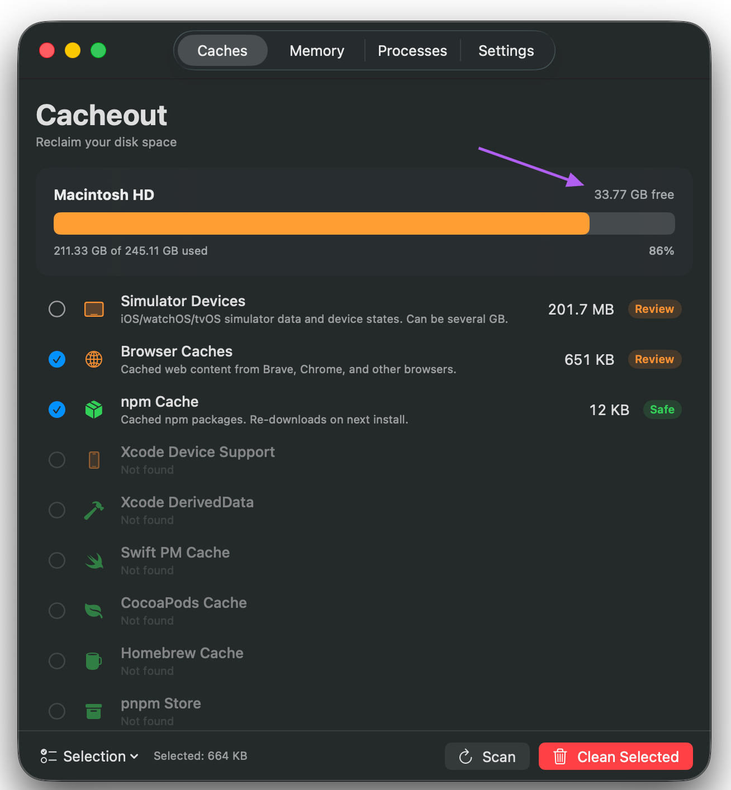

# Cacheout

A free, open-source macOS utility that helps developers reclaim disk space by scanning and cleaning common cache directories.

Built for developers on space-constrained Macs (especially the 256GB M4 Mac Mini), Cacheout finds and removes caches from Xcode, Docker, npm, Yarn, Homebrew, browsers, and more — typically recovering 20-60GB.

<p align="center">
  
  
  
</p>

## Features

- **Built-in cache categories** — Xcode, Docker, npm, Yarn, pnpm, Homebrew, Playwright, CocoaPods, Swift PM, Gradle, browser caches, VS Code, Electron, pip, and more (the full list lives in [docs/v1/CATEGORIES.md](docs/v1/CATEGORIES.md))
- **Project build-artifact scanner** — Walks your configured dev roots for build output proven by an ecosystem marker file (`target/` beside `Cargo.toml`, `node_modules/` beside `package.json`, `.venv/` containing `pyvenv.cfg`, and more), shows size and staleness (30d+), and refuses to delete a directory holding release artifacts (`.dmg`, `.pkg`, `.ipa`, `.app`, `.xcarchive`, `.dSYM`) until you acknowledge them
- **Ephemeral temp sweep** — Lists stale scratch directories in the temp locations macOS does not reliably prune (`/private/tmp` and your per-user temp/cache containers). An entry is listed only when neither it nor anything inside it has been written for 7 days and it holds at least 10 MB (both adjustable), and every gate is re-checked from a held descriptor immediately before deletion, so a workspace that has come back to life is refused. Age is the protection — Cacheout also skips an entry a program has advisory-locked, but it cannot see a program that merely holds a file inside it open for reading. Scanned only when you explicitly ask, never selected for you
- **Risk-level indicators** — Each category rated Safe / Review / Caution so you know what's risk-free
- **Async parallel scanning** — Scans all categories concurrently for fast results
- **Sparse file awareness** — Reports allocated (on-disk) usage everywhere, so sparse files — Docker's disk image, simulator disk images, and anything else logically larger than it really is — show what they actually consume, not inflated logical sizes
- **Move to Trash option** — Recoverable deletion instead of permanent removal
- **Cleanup logging** — All actions logged to `~/.cacheout/cleanup.log`
- **No admin privileges** — Runs entirely as you: user-space caches (`~/Library/`, `~/.`), your dev roots, and the ephemeral temp locations (`/private/tmp` and your own per-user temp/cache containers); another user's temp files are never listed
- **No network access** — No analytics, no telemetry, no update checks
- **Native SwiftUI** — Lightweight, fast, feels like a first-party macOS app

## Requirements

- macOS 14 (Sonoma) or later
- Xcode 15+ or Swift 5.9+ toolchain (for building from source)

## Install

### Build & Run (recommended)

```bash
git clone https://github.com/yourusername/cacheout.git
cd cacheout
bash scripts/bundle.sh
open Cacheout.app
```

This builds the project and creates a proper `Cacheout.app` bundle you can drag to `/Applications`.

### Build from source (CLI)

```bash
swift build -c release
.build/release/Cacheout
```

### Open in Xcode

```bash
open Package.swift
# Build and run from Xcode (⌘R)
```

## Cache Categories

| Category | Risk | What happens after cleaning |
|----------|------|-----------------------------|
| Xcode DerivedData | ✅ Safe | Xcode rebuilds on next build |
| Xcode Device Support | 🟡 Review | Re-downloads when you connect a device |
| Homebrew Cache | ✅ Safe | Equivalent to `brew cleanup` |
| npm Cache | ✅ Safe | npm re-downloads on install |
| Yarn Cache | ✅ Safe | Yarn re-downloads on install |
| pnpm Store | ✅ Safe | pnpm re-downloads on install |
| Playwright Browsers | ✅ Safe | `npx playwright install` to restore |
| CocoaPods Cache | ✅ Safe | `pod install` re-downloads |
| Swift PM Cache | ✅ Safe | SPM re-resolves on next build |
| Gradle Cache | ✅ Safe | Gradle re-downloads on build |
| Docker Disk Image | 🔴 Caution | Removes all Docker data — run `docker system prune -a` first |
| Browser Caches | 🟡 Review | Browsers rebuild as you browse |
| VS Code Cache | ✅ Safe | VS Code re-downloads as needed |
| Electron Cache | ✅ Safe | Re-downloads when Electron apps need it |
| pip Cache | ✅ Safe | pip re-downloads on install |

This table is a sample — see [docs/v1/CATEGORIES.md](docs/v1/CATEGORIES.md) for every category with paths, discovery method, and risk level.

## Project Build Artifacts

Cacheout walks your configured dev roots (by default `~/Documents`,
`~/Developer`, `~/Projects`, `~/Code`, `~/Sites`, `~/Desktop`, `~/Dropbox`,
`~/repos`, `~/src`, `~/work` — editable in Settings) for build-output
directories, and reports each one it can PROVE: a `target/` beside a
`Cargo.toml`, a `node_modules/` beside a `package.json`, a directory
containing a `pyvenv.cfg`, and the rest of the rule table. A directory with
the right name but no marker is never touched.

Each find shows its path, size and how long since the last build; anything
untouched for 30+ days gets an age badge, and you can select all stale finds
at once or pick individually. Sizes are allocated, sparse-aware bytes — a
Rust `target/` that looks like 57 GB but occupies 31 GB reports 31 GB, with
the apparent size shown separately so the number you budget against is the
number you get back.

**Release artifacts are protected.** Before deleting, Cacheout inspects the
directory for `.dmg`, `.pkg`, `.ipa`, `.app`, `.xcarchive` and `.dSYM`
payloads. Anything it finds is listed on the confirmation sheet and the
delete is refused until you acknowledge exactly what is there — and it
re-checks immediately before deleting, so an artifact produced after the scan
still stops the deletion.

Headless too: `--cli scan` lists every find as a `scanner_items` row, and
`--cli clean build_artifacts --confirm` (or
`build_artifacts:<item-id>` for one) deletes them. See
[docs/v1/CLI-REFERENCE.md](docs/v1/CLI-REFERENCE.md).

## Ephemeral Temp Files

`/private/tmp` and your per-user temp and cache containers collect scratch
directories that nothing on modern macOS reliably cleans up — a month-old
build sandbox or agent workspace can sit there through reboots. Cacheout
lists the stale ones: an entry qualifies when its NEWEST content is older
than the age threshold (7 days by default) and it is at least 10 MB, so a
directory holding one fresh file deep inside is left alone, and so is
anything the current session just wrote.

Cacheout also skips an entry a process has taken an advisory lock on, but
that check only sees a lock on the entry itself — it cannot detect a process
merely holding a file open somewhere inside. Age is the real protection, and
every gate is re-established from a held descriptor immediately before
deletion, so an entry that has been written into since the scan is refused.

These locations are scanned only when you explicitly press Scan (or run
`--cli scan`) — automatic background refreshes never touch them. Findings
are always Review risk and never selected for you, temp files another user
owns are never listed, and anything Cacheout could not read is reported
rather than quietly counted as empty.

## How it works

Cacheout scans known cache directories in your home folder (`~/Library/Caches`, `~/Library/Developer`, `~/.npm`, etc.), your configured dev roots, and the ephemeral temp locations above, and calculates actual disk usage using `totalFileAllocatedSize` (which correctly handles sparse files like Docker's disk image).

You select which caches to clean, confirm the action, and Cacheout either moves them to Trash or permanently deletes them. All cleanup actions are logged.

## Contributing

PRs welcome! To add a new cache category, edit `Sources/Cacheout/Scanner/Categories.swift` and add a new `CacheCategory` entry.

## License

MIT — See [LICENSE](LICENSE)
